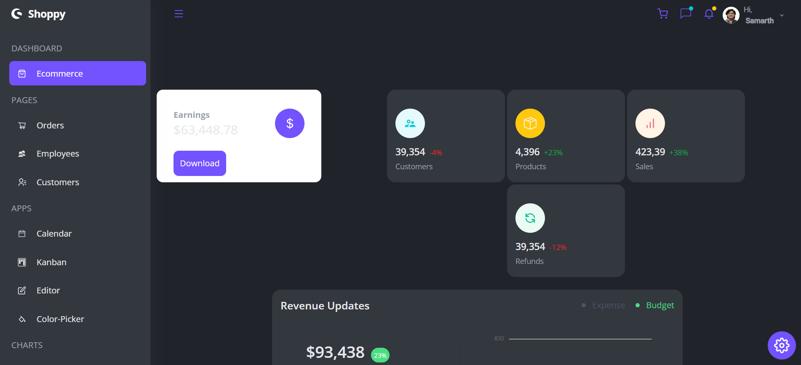

# Build and Deploy a React Admin Dashboard App With Theming, Tables, Charts, Calendar, Kanban and More

A modern, responsive React Admin Dashboard built with Syncfusion React components and styled using Tailwind CSS.  
This project showcases dashboards, charts, calendars, kanban boards, user profiles, and theme settings, ideal for internship portfolio.




---

## Features

- Responsive Sidebar and Navbar
- Multiple interactive charts (Line, Pie, Stacked, Area, Bar, Financial, Pyramid)
- Kanban board for task management
- Calendar integration
- User Profile management
- Theme customization (light/dark mode)
- Notifications and Chat components
- Built with React, Syncfusion UI, Tailwind CSS, and CRACO

---

## Installation & Setup

1. Clone this repository:

   ```bash
   git clone https://github.com/Samarth-Shekhar/Samarth_REACT_admin_dashboard.git
   cd Samarth_REACT_admin_dashboard
Install dependencies:

bash
Copy
Edit
npm install
Start development server:

bash
Copy
Edit
npm start
Open your browser at http://localhost:3000

## Technologies Used
React.js (Functional components & hooks)

Syncfusion React Components (Charts, Calendar, Kanban)

Tailwind CSS for styling

CRACO to customize Create React App configuration

JavaScript ES6+
```
## Project Structure
project_syncfusion_dashboard-main/
│
├── public/
│   ├── favicon.ico
│   ├── index.html
│   ├── logo192.png
│   └── ...
│
├── src/
│   ├── components/
│   │   ├── Navbar.jsx
│   │   ├── UserProfile.jsx
│   │   └── ...
│   ├── data/
│   │   ├── dummy.js
│   │   └── samarth.jpeg
│   ├── App.js
│   └── index.js
│
├── .gitignore
├── package.json
└── README.md

``bash
## Contribution
This project was built as an internship portfolio piece. Feel free to fork, raise issues, or submit pull requests for improvements.

## License
MIT License — see license.txt for details.

## Author
Samarth Shekhar
GitHub | LinkedIn

Thank you for checking out my internship project!
Feel free to connect for feedback or collaboration.

yaml
Copy
Edit

---

Would you like me to help you create a **LICENSE** file or a quick **GitHub Actions workflow** for CI/CD next?
